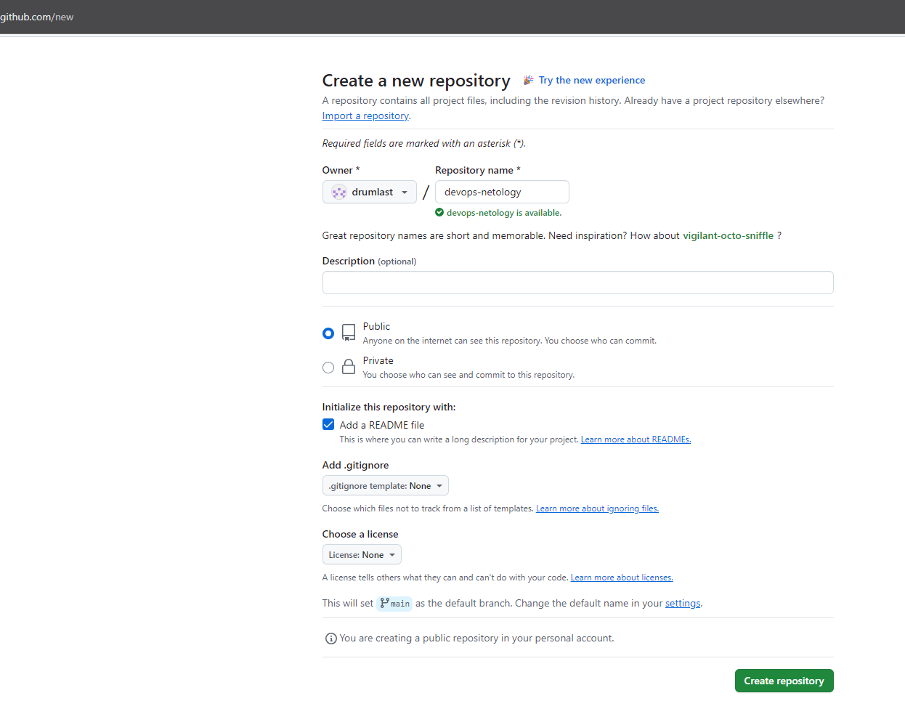
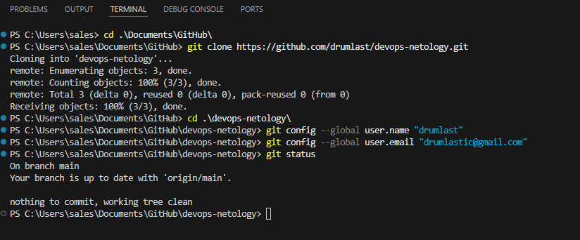

# devops-netology

### Домашнее задание к занятию «Системы контроля версий»

##### Создаем публичный репозиторий

##### Клонируем репозиторий
##### Переходим в каталог с клоном репозитория
##### Производим первоначальную настройку Git
##### Выполняем команду git status
