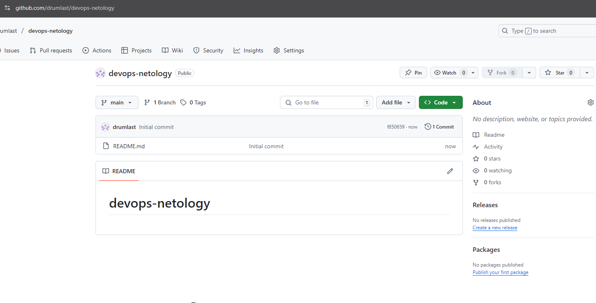

# devops-netology

### Домашнее задание к занятию «Системы контроля версий + Основы git»

##### Создаем публичный репозиторий

##### Клонируем репозиторий
##### Переходим в каталог с клоном репозитория
##### Производим первоначальную настройку Git
##### Выполняем команду git status

##### Переведите файл в состояние staged
##### Делаем коммит

##### Создаем файл .gitignore
##### Комиттим все новые и изменённые файлы

Этот .gitignore исключает временные и чувствительные файлы Terraform (*.tfstate, .terraform/, .backup и др)
В данном случае будут игнорироваться файлы с расширениями .tfstate .backup итд, причем символ * означает, что до расширения идет любой символ, таким образом из коммита можно исключить чувствительные данные, которые не нужно "светить" в публичном репозитории, например ssh-ключи, логины и пароли и тд. Также можно исключить и кэши, объемные данные, которые не относятся к основному коду и не требуются для разворачивания инфраструктуры или приложения. Символ * не единственная маска, можно исключить и каталог и подкаталог, например:
.terraform/ игнорируется весь каталог .terraform и всё его содержимое, включая вложенные каталоги и файлы и далее по аналогии.

##### Создаем файлы will_be_deleted.txt (с текстом will_be_deleted) и will_be_moved.txt (с текстом will_be_moved)
##### Удаляем файл will_be_deleted.txt с диска и из репозитория.
##### Переименовываем (перемещаем) файл will_be_moved.txt на диске и в репозитории
##### Комиттим результат работы с комментарием Moved and deleted

##### Проверка изменений командой git log

##### Дополнительный репозиторий GitLab

##### Задание 2. Теги

